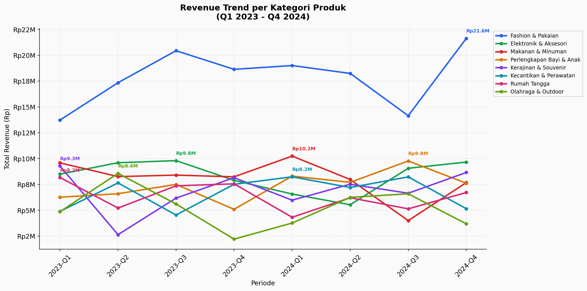
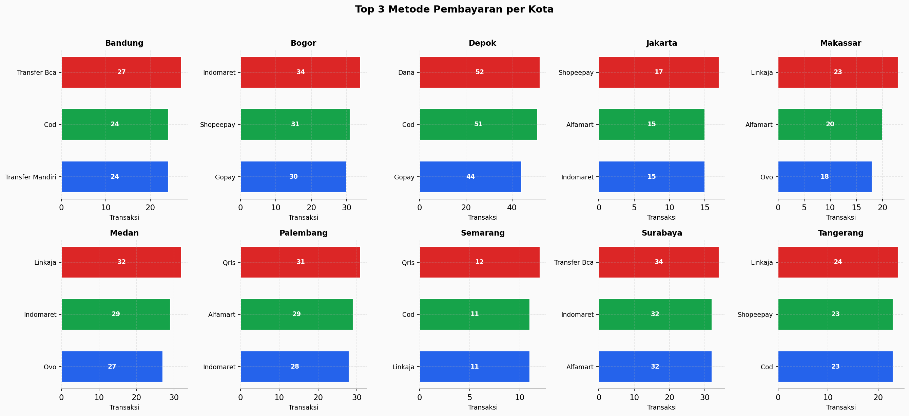
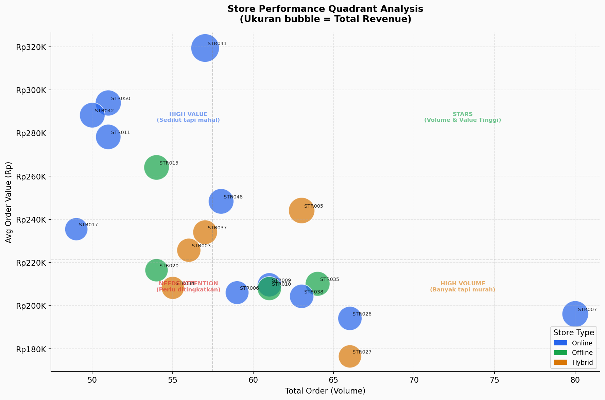
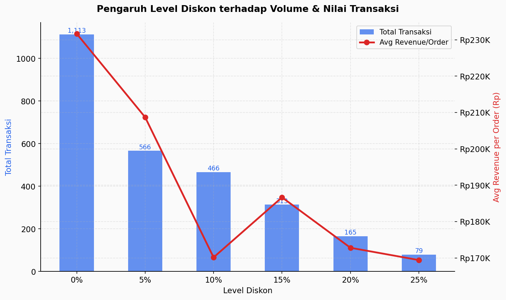
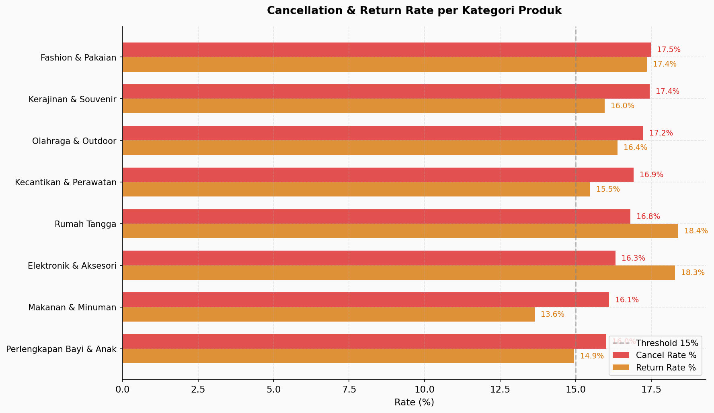

# Analisis Transaksi Retail UMKM Indonesia
### End-to-End Data Analysis | SQL · Python · Matplotlib

---

## Latar Belakang & Problem Statement

Jaringan UMKM retail multi-kategori yang beroperasi di 10 kota besar Indonesia
menghadapi tantangan dalam mengoptimalkan strategi penjualan dan mengurangi
risiko operasional. Sebagai Data Analyst, proyek ini menjawab lima pertanyaan bisnis:

1. **Kategori produk** mana yang paling berkontribusi terhadap revenue dan bagaimana tren per kuartal?
2. **Metode pembayaran** digital mana yang dominan dan apakah berbeda antar kota?
3. **Toko** mana yang menjadi top performer dan apa karakteristiknya?
4. Apakah **diskon** yang lebih besar benar-benar meningkatkan volume transaksi?
5. **Kategori** mana yang paling berisiko dari sisi cancellation & return?

---

## Dataset

| File | Baris | Deskripsi |
|------|------:|-----------|
| `transactions_raw.csv` | 5,610 | Data mentah dengan 7 tipe dirty data |
| `transactions_clean.csv` | ~5,300 | Hasil setelah data cleaning |
| `products.csv` | 56 | Katalog produk (8 kategori) |
| `customers.csv` | 1,000 | Profil pelanggan (10 kota) |
| `stores.csv` | 50 | Data toko UMKM |

**Periode:** Januari 2023 – Desember 2024  
**Sumber:** Synthetic dataset berbasis konteks pasar retail Indonesia

### Dirty Data yang Diinjeksi (untuk latihan cleaning)
- Missing values pada `payment_method`, `discount_pct`, `city`
- Duplicate rows (~2%)
- Format tanggal tidak konsisten (4 format berbeda)
- Inkonsistensi casing pada `category` dan `payment_method`
- Outlier harga (~10x lipat dari nilai normal)
- Nilai `qty` negatif (data entry error)

---

## Metodologi & Pipeline

```
Raw Data
   │
   ▼
[Step 1] Data Cleaning (Python/Pandas)
   │  • Drop duplicates
   │  • Standardisasi format tanggal
   │  • Fix inkonsistensi teks (category, payment_method)
   │  • Handle missing values dengan business logic
   │  • Remove outlier harga (IQR per kategori)
   │
   ▼
[Step 2] SQL Analysis (DuckDB)
   │  • Revenue per kategori per kuartal
   │  • Dominasi metode pembayaran per kota
   │  • Store performance (CTE + Window Function)
   │  • Pengaruh diskon terhadap volume
   │  • Cancellation & return rate per kategori
   │
   ▼
[Step 3] Visualisasi & Storytelling (Matplotlib)
   │  • Line chart tren revenue
   │  • Grouped bar chart metode pembayaran
   │  • Quadrant analysis performa toko
   │  • Dual-axis chart dampak diskon
   │  • Horizontal bar chart risiko operasional
   │
   ▼
Business Insight & Rekomendasi
```

---

## Key Findings

### 1. Revenue & Kategori
- **Total transaksi delivered:** 2,624 order | **Total revenue:** Rp533,899,790
- **Fashion & Pakaian** mendominasi dengan revenue **Rp143,210,335** (26.8% dari total)
- 8 kategori produk aktif dengan distribusi revenue yang relatif merata di luar Fashion

### 2. Metode Pembayaran
- **Indomaret** menjadi metode terpopuler dengan **228 transaksi**
- Pembayaran berbasis minimarket (Indomaret & Alfamart) mendominasi — mengindikasikan segmen pelanggan yang belum sepenuhnya beralih ke dompet digital
- Potensi pertumbuhan besar untuk GoPay, OVO, dan QRIS melalui edukasi & promo

### 3. Performa Toko
- **20 toko aktif** teridentifikasi dalam analisis top performer
- **Toko Makmur Semarang** menjadi top store dengan revenue **Rp18,205,930**
- Quadrant analysis mengidentifikasi toko STARS (high volume + high value) sebagai benchmark replikasi strategi

### 4. Strategi Diskon
- Transaksi **tanpa diskon (0%)** mencatat volume tertinggi
- Temuan ini mengindikasikan bahwa pelanggan UMKM ini tidak bergantung pada diskon — kualitas produk & kepercayaan merek lebih berpengaruh
- Diskon agresif tidak perlu diprioritaskan; margin dapat dipertahankan

### 5. Risiko Operasional
- **Fashion & Pakaian** memiliki cancel rate tertinggi sebesar **17.5%** — melampaui threshold 15%
- Kemungkinan penyebab: ekspektasi produk tidak sesuai (ukuran, warna), perlu perbaikan foto produk & size guide
- Kategori lain berada di bawah threshold 15% — relatif aman

---

## Rekomendasi Bisnis

| Prioritas | Aksi | Target Kategori |
|-----------|------|-----------------|
| 🔴 HIGH | Audit deskripsi produk & size guide untuk turunkan cancel rate dari 17.5% ke <12% | Fashion & Pakaian |
| 🔴 HIGH | Skalakan stok & variasi produk sebagai kategori revenue driver utama | Fashion & Pakaian |
| 🟡 MEDIUM | Kampanye edukasi dompet digital (GoPay, OVO, QRIS) untuk geser dari COD/minimarket | Semua kota |
| 🟡 MEDIUM | Replikasi strategi Toko Makmur Semarang ke toko performa rendah (quadrant "Needs Attention") | Store Management |
| 🟢 LOW | Pertahankan kebijakan harga tanpa diskon agresif — fokus pada value & kualitas | Semua kategori |

---

## Visualisasi

| Chart | Insight |
|-------|---------|
|  | Tren revenue per kategori Q1 2023 – Q4 2024 |
|  | Dominasi metode pembayaran per kota |
|  | Segmentasi performa toko (4 kuadran) |
|  | Pengaruh level diskon terhadap volume & nilai |
|  | Risiko operasional per kategori |

---

## Tech Stack

| Tools | Kegunaan |
|-------|----------|
| Python 3.x | Data cleaning & visualisasi |
| Pandas | Manipulasi & transformasi data |
| Matplotlib | Visualisasi & storytelling |
| DuckDB | SQL analysis (in-process, tanpa server) |
| Jupyter Notebook | Interactive development |
| VS Code | IDE |
| Git & GitHub | Version control & portofolio |

---

## Struktur Repository

```
umkm-retail-analysis/
├── data/
│   ├── raw/                  ← Dataset original
│   └── processed/            ← Hasil cleaning & query
├── notebooks/
│   ├── 01_data_cleaning.ipynb
│   ├── 02_sql_analysis.ipynb
│   └── 03_visualization.ipynb
├── outputs/
│   └── charts/               ← Semua chart PNG
├── umkm_retail.duckdb        ← Database lokal
└── README.md
```
